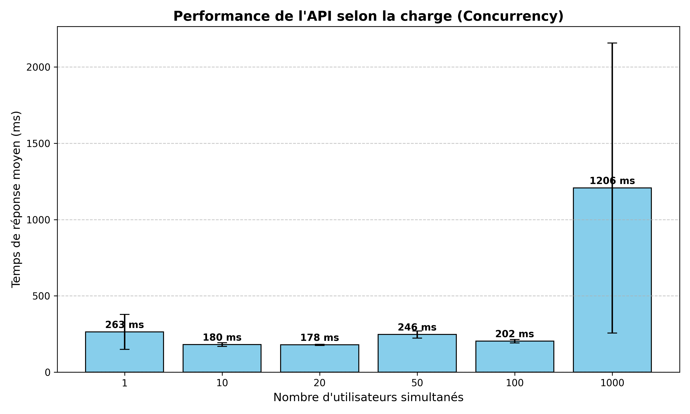
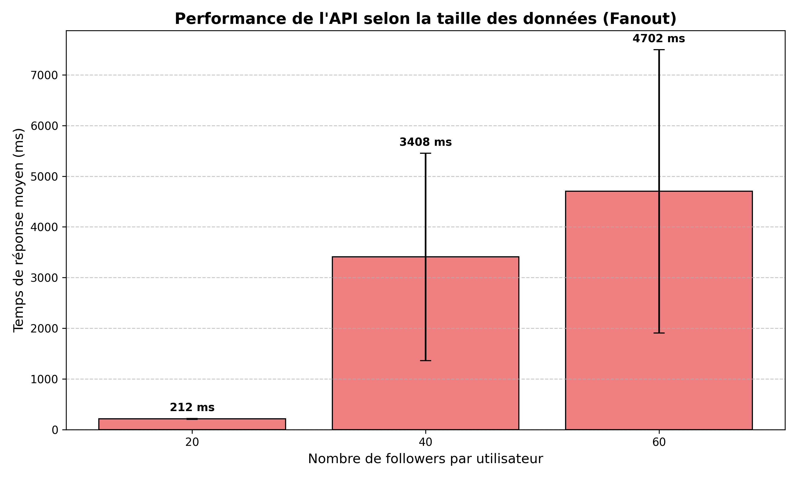

## TP Tiny Insta

**Réalisé par :** Dudonné Baptiste
**URL de l'application :** [https://tp1-cloud2.ue.r.appspot.com](https://tp1-cloud2.ue.r.appspot.com)

### 1. Passage à l'échelle sur la charge (Concurrency)

**Résultats bruts (extraits de `out/conc.csv`) :**
| Utilisateurs (PARAM) | Run 1 | Run 2 | Run 3 | Instances allouées |
|---|---|---|---|---|
| 1 | 426ms | 177ms | 187ms | 1 |
| 10 | 172ms | 172ms | 197ms | 1 à 2 |
| 20 | 184ms | 177ms | 175ms | 2 |
| 50 | 272ms | 251ms | 216ms | 4 |
| 100 | 217ms | 199ms | 191ms | 3 à 4 |
| 1000 | 2497ms | 892ms | 231ms | 10 -> 20 |

**Explication des résultats :**
L'application **scale de manière très efficace** face à une montée en charge. Jusqu'à 100 utilisateurs simultanés, le temps de réponse reste remarquablement stable aux alentours de 200ms (grâce à l'augmentation de 1 à 4 instances). 
Lorsqu'on passe brusquement à 1000 utilisateurs, le temps de réponse grimpe initialement (2497ms au run 1). Cela s'explique par les **"cold starts"** : App Engine doit instancier un grand nombre de nouveaux serveurs à la volée. Cependant, le système réagit très bien : dès les runs 2 et 3, le nombre d'instances passe de 10 à 20, permettant au temps de réponse de redescendre drastiquement (jusqu'à 231ms au run 3), retrouvant sa vitesse normale.

**Ce qu'il faudrait faire :** 
- Configurer un nombre d'instances minimum (warm instances) pour éviter le délai du premier pic de charge.
- Implémenter un cache en mémoire (ex: Redis ou Memcached) pour servir les requêtes de timeline les plus fréquentes et réduire la pression sur le Datastore.

### 2. Passage à l'échelle sur la taille des données (Fanout)

**Résultats bruts (extraits de `out/fanout.csv`) :**
| Followers (PARAM) | Run 1 | Run 2 | Run 3 | Instances allouées |
|---|---|---|---|---|
| 20 | 223ms | 212ms | 202ms | 11 |
| 40 | 6109ms | 2959ms | 1157ms | 11 |
| 60 | 8399ms | 4076ms | 1631ms | 12 |

**Explication des résultats :**
À l'inverse, **l'application ne scale pas du tout** sur la taille du réseau. Le chargement de la timeline s'appuie sur une requête `IN` sur Datastore. Avec 20 followers, on observe ~210ms. Dès 40 followers, le temps explose à plus de 6 secondes au premier lancement. À 60 followers, on dépasse les 8 secondes ! Le moteur Datastore peine à scanner les multiples index et à fusionner côté serveur une quantité de données aussi conséquente. (La baisse de temps observée sur les runs 2 et 3 est due aux mécanismes de cache internes de l'infrastructure GCP, mais l'architecture reste inadaptée pour la première lecture).

**Ce qu'il faudrait faire :** 
- Mettre en place une architecture de données en mode **"Push" (Fan-out on write)** au lieu de l'actuel "Pull". Lorsqu'un utilisateur publie un post, un processus en arrière-plan devrait l'insérer directement dans l'entité "Timeline" de chacun de ses abonnés.
- La lecture de la timeline redeviendrait ainsi une simple requête d'accès sur une seule entité (`SELECT * FROM Timeline WHERE owner = @me`), garantissant un temps de lecture constant en **O(1)**, qu'il y ait 10 ou 100 000 followers.